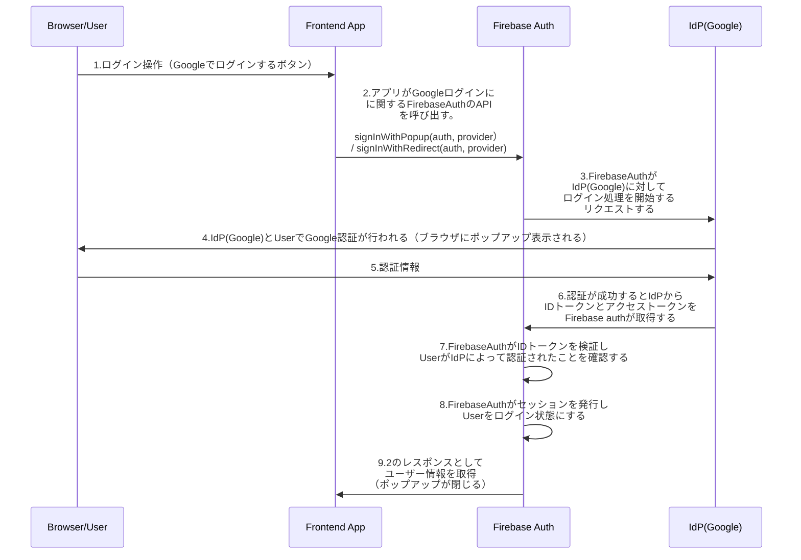

# social-login-firebase-sample

## get started

```bash
# ツールインストール
$ npm install -g firebase-tools

# バージョン確認
$ firebase --version

# ログイン
$ firebase login

# プロジェクト作成
$ firebase init

# デプロイ
$ firebase deploy

# ビルド & デプロイ
$ npm run deploy
```

## シーケンス図


